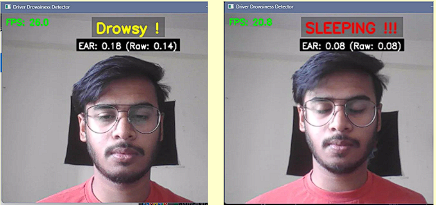
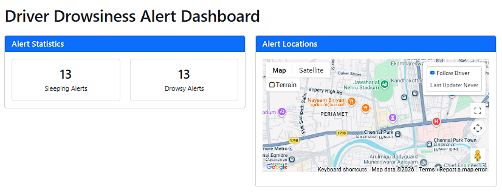
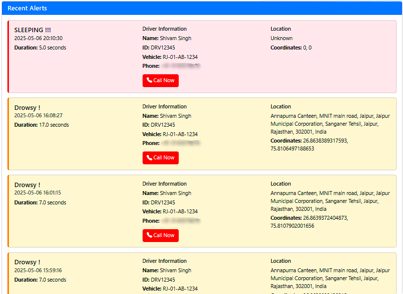

# Driver Drowsiness Detection System with Real-Time Dashboard

A computer-vision based system that monitors driver alertness in real-time using a webcam and facial landmark analysis. When drowsiness or sleep is detected, the system triggers audio alerts and pushes notifications to a live web dashboard — enabling remote fleet monitoring.

## Detection Window

<!-- Screenshots / Demo -->
## Dashboard


<!-- Replace with your actual screenshot path or hosted image URL -->


---

## How It Works

1. **Calibration** — On launch, the driver is guided through a short calibration (eyes open → half-closed → fully closed) to personalise detection thresholds.
2. **Eye Aspect Ratio (EAR)** — The system uses dlib's 68-point facial landmark model to compute the EAR every frame. A moving-average filter smooths out noise.
3. **State Classification** — Based on the smoothed EAR and calibrated thresholds, the driver is classified as **Active**, **Drowsy**, or **Sleeping**.
4. **Alerts** — If drowsiness persists beyond a configurable duration, an audible alarm plays and the event (with GPS location & driver info) is logged and pushed to the dashboard in real-time via WebSockets.

## Features

- Real-time webcam-based drowsiness detection (OpenCV + dlib)
- Personalised per-driver calibration for reliable thresholds
- Audio alarm on prolonged sleep detection
- Live web dashboard (Flask + Socket.IO) with:
  - Alert statistics (sleeping / drowsy counts)
  - Google Maps integration with driver path tracking
  - Real-time push notifications via WebSockets
- GPS location tracking with reverse-geocoded addresses
- Driver credential management via a Tkinter GUI
- Alert history persisted to JSON

## Tech Stack

| Layer | Technologies |
|---|---|
| Detection | Python, OpenCV, dlib, NumPy |
| Backend | Flask, Flask-SocketIO |
| Frontend | Bootstrap 5, Socket.IO, Google Maps JS API |
| Location | Windows Location API (PowerShell), Geopy |

## Project Structure

```
.
├── driver2.py            # Core drowsiness detection engine
├── dashboard.py          # Flask web dashboard server
├── driver_config.py      # Tkinter GUI for driver credentials
├── driver_config.json    # Stored driver configuration
├── get_location.ps1      # PowerShell script for GPS coordinates
├── templates/
│   └── index.html        # Dashboard UI template
├── requirements.txt      # Project dependencies
└── README.md             # Project documentation
```

## Getting Started

### Prerequisites

- Python 3.8+
- Windows OS (for `winsound` audio alerts and location API)
- Webcam
- [shape_predictor_68_face_landmarks.dat](http://dlib.net/files/shape_predictor_68_face_landmarks.dat.bz2) — download, extract, and place in the project root directory

### Installation

```bash
pip install -r requirements.txt
```

Create a `.env` file for the Google Maps API key (optional, needed for map on dashboard):
```
GOOGLE_MAPS_API_KEY=your_key_here
```

### Running

**1. Configure driver credentials (optional)**
```bash
python driver_config.py
```

**2. Start the monitoring dashboard**
```bash
python dashboard.py
```
Dashboard will be available at `http://localhost:5000`

**3. Start the detection system**
```bash
python driver2.py
```
Follow the on-screen calibration prompts, then detection begins automatically. Press `ESC` to stop.

## Configuration

| Parameter | Location | Default |
|---|---|---|
| Sleep alert threshold | `driver2.py` | 5 seconds |
| Drowsy alert threshold | `driver2.py` | 7 seconds |
| Location update interval | `driver2.py` | 5 seconds |
| Camera resolution | `driver2.py` | 640 × 480 |
| EAR smoothing buffer | `driver2.py` | 5 frames |

## Future Scope

- Cross-platform audio alerts (replace `winsound`)
- Multi-driver / fleet support
- Cloud deployment with database-backed alert history
- SMS / phone call integration for emergency contacts

## License

MIT